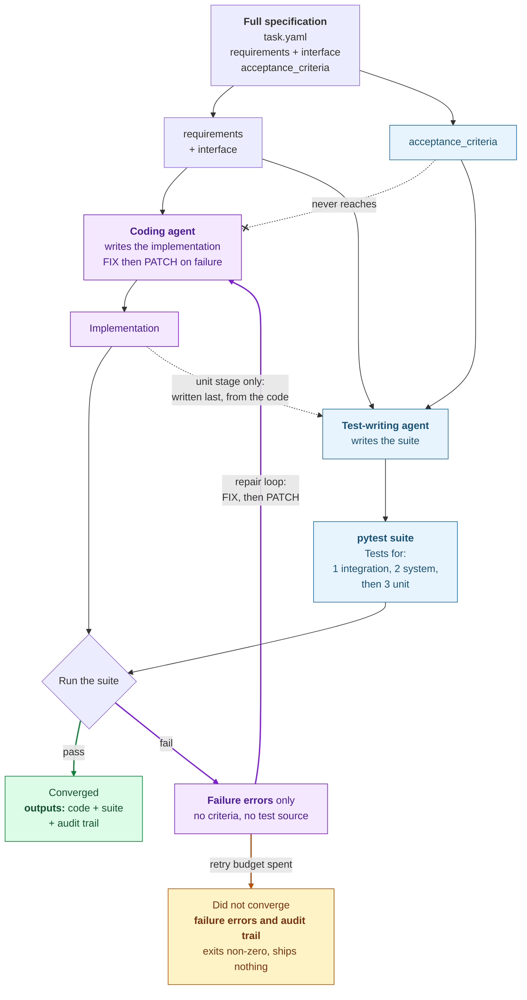

# qikly

[](https://github.com/gal-a/qikly/actions/workflows/ci.yml)
[](https://pypi.org/project/qikly/)
[](LICENSE)

**The problem: Your AI writes both the code and its tests. How do you know the tests are really valid?**

**The solution: two agents. One turns the acceptance criteria into tests. The other writes the code and never sees the acceptance criteria.**

Imagine a student who writes the exam paper, writes the answer key, and then
sits the exam. They pass. Obviously they pass, and nobody would accept that as
evidence the student knows the material.

That is what happens when one model is given a specification containing the
acceptance criteria and asked to produce both the implementation and the suite
that checks it. It writes tests its own code will pass. Everything goes green,
and the green means nothing.

qikly takes the answer key away from the student.

It is an autonomous coding agent that writes an implementation from a
specification, then verifies and repairs it against tests it generated itself,
until they all pass or a retry budget runs out. Every failure, every piece of
reasoning and every diff is recorded.

**The part that makes the result mean something:** the coding agent never sees
`acceptance_criteria`. It gets the specification with that section stripped
out, the same vague brief a developer works from, while test generation gets
it in full. When a test fails, the agent sees the failure message and never
the rule it broke. Without that asymmetry both sides read the same spec
identically and every test passes first try, which proves nothing.



**Purple is what the coding agent can see. Blue is what the standard is
written from.** They never touch. A run that never converges is still worth having: it exits
non-zero, names the blocking tests, and keeps the same complete record. The red arrows are the repair loop, and that is where
almost all of a run happens: a failing suite sends the agent the failure text
and nothing else, it produces a FIX and a PATCH, and the suite runs again,
until the stage passes or the retry budget runs out. It never sees the rule it
broke, so it cannot write code shaped to a criterion it was shown.
`tests/test_withholding.py` fails the build if any call site lets one through.

A run works through three stages, `integration` then `system` then `unit`:

1. **Integration and system tests are generated first**, from the spec alone,
   before any code exists. They cannot see an implementation because there is
   not one yet.
2. **The coding agent writes the implementation**, from the spec minus the
   criteria.
3. **pytest runs.** On failure the model produces a **FIX** (failure summary,
   root cause, plan, and the files it intends to touch) and then a **PATCH**
   (a unified diff of only those files), applied all or nothing. Repeat until
   the stage passes or the budget is spent.
4. **Unit tests are generated last**, once real code exists for them to name.
   This is the only stage allowed to see the implementation.
5. **Clearing a stage re-runs the earlier ones**, so a later fix cannot
   silently break something that already passed.


Every arrow back into **FIX** carries the pytest error text and nothing else.
Unit tests come last because they are the only ones that need to name real
functions, which makes them the only stage allowed to read the implementation.
Re-running the earlier stages after each success is what stops a later repair
quietly breaking something that already passed.

## What makes this different

**The tests come from the standard, not from the code.** This is the one
that matters most. Every other AI test generator in this space writes its tests
*from an implementation that already exists*, so it can only describe what the
code already does. That makes an excellent regression harness, and it cannot
tell you the code is wrong. qikly writes the integration and system suites from
the acceptance criteria **before any implementation exists**, so the standard
cannot have been shaped by the thing it judges.

**The withholding is a mechanism you can watch.** Not a prompt asking a
model to ignore a section, and not a convention someone has to remember. One
command prints what each side is given and the difference between them,
offline and free:

```bash
qikly --explain <MY_TASK>     # e.g. qikly --explain MERGE_SALES
```

Eleven criteria go to test generation. Twelve lines are removed before the
coding agent sees the same file. `tests/test_withholding.py` fails the build if
any call site ever lets one through, including one added next year by someone
who has never read this. It is a property of the code, and it takes thirty
seconds to check.

**What you get is an executable suite you keep.** The output is pytest files
and JUnit XML. Read them, run them, put them in CI, and when one fails in six
months it fails for a reason you can inspect and argue with. A suite is a
durable asset in a way a model's verdict is not: a verdict cannot be re-run
against tomorrow's commit.

**It helps you write the standard, not just check against it.** `--init` and
`--scaffold` turn existing code into a task, `--criteria-from` lifts criteria
out of a ticket you already wrote, `--generate-criteria` drafts a first bar from
requirements alone, and `--check-criteria` looks for a requirement and a
criterion that no implementation could satisfy at once.

**Every run is reproducible, and the whole trail is kept.** A run records the
provider, the model, the settings and the version that produced it, next to
every failing test, every FIX with its stated root cause, and every PATCH as a
diff. You can read back exactly why a line of code exists: which assertion
forced it, what the model concluded, and what it changed. The record survives a
run that never converges, which is when you most want it.

### "Why not just use two different models?"

It is the first thing most people ask, and it does help a little. It does not
reach the underlying issue, because both models still read the same criteria
and so both still write to them: the code is still built to satisfy the
standard it is about to be judged by, and changing who types it does not change
what they were shown. It is also a habit rather than a mechanism, and nothing
checks the two stayed different.

The two compose nicely, incidentally, since qikly picks a provider and model
per agent role. You can withhold *and* use two models.

### "Why not just add a reviewer agent?"

The newer version of the same question, and the one worth answering carefully,
because independent verification steps are now shipping in mainstream coding
agents: a second agent, often from a different model family, reviews what the
first one produced.

It helps, and it does not reach this. A reviewer given the same specification
has read the same acceptance criteria, and resolves the same ambiguity the same
way. It will catch a mistake that is visible from that context: an inconsistency,
a requirement plainly skipped, an obvious bug. It cannot catch the case this
tool is built for, where the code and the standard agree because both came from
one reading of a line that could have been read two ways. Nobody in that loop
is wrong relative to the shared interpretation, which is exactly why everybody
agrees.

The problem was never that nothing was checking. It is that everything checking
had already seen the answer key. Withholding is what makes the check structural
rather than one more opinion drawn from the same context, and it is enforced by
a test rather than by an arrangement someone has to remember to keep.

There is a second difference, and it outlasts the run: a reviewer emits a
verdict, and this emits a pytest suite you still have in six months.

Design rationale, and the harder problem of where `acceptance_criteria` comes
from in the first place: **[docs/design_1_case_study.md](docs/design_1_case_study.md)**,
the first of three parts.

## What it is for

Built for **self-contained Python modules that transform data, not for a large
existing repository.**: ETL, merges, calculations, validation. That is the layer where a wrong answer looks like a
right answer, and where a test written from the rule is the only thing that
catches it.

**Where it does not fit today:** an existing large repository. PATCH prompts
load only the files a FIX names, and while a large file is now excerpted rather
than loaded whole, there is no cross-file index. See
[Where it fits today](#where-it-fits-today).

## How to use the tools in this project

Four ways in, and the table under [Quick start](#which-command-depends-on-which-parts-you-already-have)
says which command each one needs:

1. **Verify code you did not write.** Supply an implementation through `seed:`
   and the suite is written from criteria its author never saw. A suite
   generated from the same context as the code is a model agreeing with itself.
2. **Start from a spec.** No code yet: get a first implementation and the suite
   that justifies it, in `outputs/`, never in your source tree.
3. **Bring your own tests.** Seed any stage and the loop becomes a repair
   procedure rather than a generator.
4. **Run a catalog unattended.** Non-zero exit on any non-convergence, so a
   scheduler or CI job can run many specs and keep the reports.

## Try it without spending anything

Three commands that make no model call, need no API key, and cost nothing.

```bash
qikly --explain MERGE_SALES   # what each side is shown, and the difference
qikly --validate              # check your task files: YAML, criteria, fixtures
qikly --explain MERGE_SALES --json
```

`--explain` is the one worth running first. It prints the acceptance criteria
that test generation receives, then the same task file as the coding agent
receives it, then the diff: on `MERGE_SALES`, eleven criteria and twelve
lines removed. It builds those strings through the same function a real run
uses, so it shows the mechanism rather than a description of it.

`--validate` reads your task files and nothing else: that they parse, that
`acceptance_criteria` is a list rather than one long string, that fixture paths
resolve, and that criteria name values instead of adjectives. It is also
available as a pre-commit hook, `qikly-validate`, deliberately the free check
rather than the paid one.

## Quick start

Requires **Python 3.10+** and **GNU `patch`** on `PATH`. On Windows it ships
with Git under `usr\bin\patch.exe`, which the tool finds on its own.

```bash
pip install qikly
export GEMINI_API_KEY=...     # or API_KEY, or your provider's own variable
qikly --demo
```

On Windows, in PowerShell, where `export` is not a command:

```powershell
pip install qikly
$env:GEMINI_API_KEY = "..."
qikly --demo
```

Other providers, and how to set a key so it survives a new terminal, are in
[docs/PROVIDER_KEY_SETUP.md](docs/PROVIDER_KEY_SETUP.md).

### Which command depends on which parts you already have

A task file is one YAML file with three parts, and the split above is a split
between them:

1. **`requirements`** what the code must do, in the words a person would use.
   The coding agent reads this.
2. **`interface`** the contract, and a description rather than code: the
   function signatures and the dotted path where the module will live. Both
   agents read it, and neither is handed an implementation to read from it.
   When the integration and system tests are written there is not one yet.
3. **`acceptance_criteria`** what counts as correct, each one checkable and
   naming its boundary value. **Only test generation reads this.**

"Spec" below means 1 and 2 together, which is what the coding agent is given.
A tick means you already have that part.

One thing the three parts do not say, and it matters: **test generation never
reads the implementation either.** Integration and system tests are written
before any code exists, from the specification alone. The unit stage is the
single exception, written last from the code that just cleared the earlier
stages, because unit tests have to name real functions.

| Where you are starting | #1 | #2 | #3 | Run | What happens |
|---|:-:|:-:|:-:|---|---|
| Before anything else: see what is withheld | | | | `qikly --explain <MY_TASK>`<br>e.g. `qikly --explain CALC_TAX` | Prints a task file twice, once as each agent receives it, and the difference between them. No API key, no model call, about a second. **You get:** the acceptance criteria on one side and the same file with them cut out on the other, which is the claim everything else rests on. |
| Just looking | | | | `qikly --demo` | A bundled task end to end in a throwaway folder. Thirty seconds, under a cent. **You get:** a working implementation, three test suites, and the full record of every FIX and PATCH, in a directory you can delete. |
| Code someone else wrote, and you want **that code** verified | | Y | | `qikly --scaffold <MY_MODULE>.py` | Scaffold reads the real signatures out of the file you point it at and fills in **#2** for you. **#1** and **#3** stay yours to write: criteria read out of an implementation can only describe what that implementation already does, which is a bar it passes by construction. **You get:** two task files. One tests the code you already have; the other writes a fresh implementation of the same interface. Keep whichever matches the job and delete the other. |
| You know what it must do, not yet how to check it | Y | | | `qikly --init` | Creates the directory layout and one starter task to edit. Its criteria show the habit that matters most: name the value, not the quality. "100 is accepted and 101 is rejected" forces a test at the boundary; "amounts must be reasonable" does not. **You get:** a task file to fill in, with your fixtures where a run will look for them. |
| Same, but you want a first draft of the bar | Y | Y | | `qikly --tasks <MY_TASKS>`<br>`--generate-criteria` | Drafts **#3** from **#1** alone, then runs. **You get:** a first draft of the bar written into your task file for you to correct, plus the implementation and suites. |
| You have written all three | Y | Y | Y | `qikly --tasks <MY_TASKS>` | Everything you wrote is used, and nothing is drafted on your behalf. **You get:** an implementation, integration, system and unit suites, a convergence report, and a run summary recording the model and settings that produced them. |
| You have all three but doubt they agree | Y | Y | Y | `qikly --check-criteria`<br>`--tasks <MY_TASKS>` | One model call asking whether any implementation could satisfy **#1** and **#3** at once. Advisory, and exits non-zero on a contradiction so a pipeline can gate on it. **You get:** a list of the requirement and criterion pairs that cannot both hold, before spending a stage budget on them. |
| A previous run stopped before finishing | Y | Y | Y | `qikly --tasks <MY_TASKS>`<br>`--resume` | Generating the tests and the first implementation already cost model calls, and they are still on disk. This keeps them and picks up where it stopped, instead of paying for them twice. **You get:** the same outputs as a full run, without paying for the parts already built. |

`<MY_TASKS>` is one task_id or several separated by commas. A task_id is a
filename under `inputs_private/config/tasks/` without the `.yaml`:
`--tasks CALC_TAX`, `--tasks CALC_TAX,MERGE_SALES`, or omit it to run every
task found. `<MY_TASK>`, singular, takes exactly one.

`QIKLY_MAX_CALLS=200 qikly` stops at a call limit rather than a bill.

`--scaffold` reads the module path and the real signatures of every public
function straight out of the file, because they are already there. It leaves
`requirements` and `acceptance_criteria` for you, and that is deliberate:
criteria derived from an implementation can only describe what that
implementation already does, and a bar that agrees with the code by
construction is the exact failure this tool exists to prevent.

`--demo` runs one task end to end in a throwaway `demo/<timestamp>/` directory
and prints what it built and where. It writes nothing outside that directory,
so a first run leaves everything else untouched. About 30 seconds.


That is a real run on `gemini-3.5-flash-lite`, 38 seconds, not sped up.

From a clone instead:

```bash
pip install -r requirements.txt
python run.py --demo
```

`run.py` is a shim around `src/qikly/cli.py`, the same entry point the
installed `qikly` command calls, so a clone and an install run identical
code.

## Running

```bash
python run.py                            # every task found
python run.py --tasks ETL_ADDRESS        # one
python run.py --tasks ETL_ADDRESS,ETL_EMAIL
python run.py --demo --tasks MERGE_STOCK # isolated, any task
```

Each task runs in its own process, concurrently, with console output prefixed
`[task_id]`. Exit code is non-zero if any task did not fully converge.

**Expect some runs to stall, by design.** Roughly 8 runs in 10 finish with the
code passing every integration and system test. Roughly 6 in 10 pass everything
including unit tests. Nearly the whole gap between those two figures is the unit
stage.

Those are round numbers because they were measured three times: a 427-run sweep,
a 140-run sweep sixteen days later on the same tasks and settings, and a 400-run
sweep after correcting the benchmark itself, when eight of the ten tasks turned
out to be carrying acceptance criteria that no input row could trigger. All
three landed inside each other's intervals. All three used
`gemini-3.5-flash-lite`, a small cheap model chosen to make repeated sweeps
affordable, so treat them as a floor. Three sweeps agreeing is worth more than
any one of them's decimal places, so the decimal places are not quoted.

A run that exhausts its budget exits non-zero, names the tests that blocked it,
and keeps the full record. It never reports success on code its own tests
reject.

Ten example tasks ship with the tool across four domains, listed in
[docs/design_3_mechanism.md](docs/design_3_mechanism.md#example-tasks).

**Measuring rather than producing.** One run is an artifact, not a rate: the
same task with the same seed converges on some runs and not others. To claim
how often anything converges, repeat the sweep and read the interval:

```bash
python -m qikly.orchestrator.run_all --repeat 10
```

That writes an aggregate report with confidence intervals and groups the
non-converging runs by what they got stuck on. Details in
[docs/design_3_mechanism.md](docs/design_3_mechanism.md#measuring-rather-than-producing).

## When a run does not converge

A stall is a normal outcome, not a broken tool: the run exits non-zero, names
the blocking tests, keeps the whole record, and ships nothing.

The first thing to try is **a stronger model**, which moves convergence more
than any setting in this file and costs one environment variable. After that,
in order of how often each is the answer: read the timeline report, look for the
same patch repeating (a criterion fighting the model's priors), check for a
collection error (nothing ran at all), and run `--check-criteria`, `--validate`
and `propose_fixtures`.

**Each of those, with the signature to look for and the fix:**
[docs/TROUBLESHOOTING.md](docs/TROUBLESHOOTING.md).

## Output

Everything is namespaced by `task_id` so concurrent runs never collide:

| Path | Contents |
|---|---|
| `outputs/agent_src/code/<task_id>/` | The implementation the coding agent wrote. Cleared (backed up under `old/<timestamp>/`) at the start of each run. |
| `outputs/tests/<task_id>/{integration,system,unit}/` | The generated test files for this run. |
| `outputs/data/<task_id>/` | The task's actual output artifact (e.g. `output.json`). |
| `outputs/logs/transactions_<task_id>_<run_timestamp>.jsonl` | Append-only structured log of every test run, FIX, PATCH, and apply outcome: the source of truth for the run. |
| `outputs/logs/patches/<task_id>/<run_timestamp>/<fix_id>.diff` | Every patch the agent generated, whether or not it applied. |
| `outputs/reports/junit/<task_id>_<run_timestamp>.xml` | **JUnit XML for the run**, one `<testsuite>` per stage. The one artifact here another system reads: import it into Xray, qTest or TestRail, or publish it from CI. Per-stage files sit beside it, each holding that stage's final state. A stage that never ran is absent rather than reported as an empty pass. |
| `outputs/reports/iterations/<task_id>_<stage>_<run_timestamp>.txt` | Live-appended one-line-per-attempt pass/fail summary (what streams to the console). |
| `outputs/reports/iterations/<task_id>_<run_timestamp>_report.html` | **Start here.** A single-page debugging timeline for the run. Open it in a browser. Generated automatically at the end of every `run.py` invocation (path printed to console), or on demand: `python -m qikly.orchestrator.reports.report [--task ID] [--run TIMESTAMP]`. Links to the matching metrics report; stays focused on the narrative, no duplicated numbers. |
| `outputs/reports/metrics/<task_id>_<run_timestamp>_metrics.html` | A numbers-first companion: a KPI row (iterations, FIX/PATCH attempts, regressions caught, apply-failure rate, run duration), a per-stage iteration chart, and a FIX/PATCH outcome breakdown. Links back to the matching debugging timeline. Same generation triggers as the timeline report, or on demand: `python -m qikly.orchestrator.reports.metrics_report [--task ID] [--run TIMESTAMP]`. Scoped to one run today; see [Where it fits today](#where-it-fits-today). |
| `outputs/reports/run_summary/<task_id>_<run_timestamp>.json` | The same numbers as the metrics report, as JSON instead of HTML, so runs can be compared across time by a script. Written automatically at the end of every `run.py` invocation. Stays on your disk. The only network calls this project makes are to your configured LLM provider and, unless disabled, a check for a newer release at startup (see [Version check](#version-check)). |
| `outputs/reports/aggregate/aggregate_<timestamp>.{html,json}` | Many runs at once, rather than one: see [Running everything at once](docs/design_3_mechanism.md#measuring-rather-than-producing) for what it reports and why. Written by `--repeat`, or on demand: `python -m qikly.orchestrator.reports.aggregate_report [--task ID] [--last N]`. Reads the `run_summary/` JSONs only, so no LLM calls and free to re-run. |

## Running it on your own data

Four steps. Nothing is written into the package, and nothing is written into
your source tree.

### 1. Make the two directories

Anywhere you want to work. The presence of `inputs_private/` is what marks a
directory as your project.

```bash
mkdir -p inputs_private/config/tasks
mkdir -p inputs_private/data/MY_TASK
```

Or let `qikly --init` create both, plus a starter task to copy.

Until one of those exists, there is nothing marking your directory, and the
fallback in [Where things live](#where-things-live) applies. From a
`pip install -e` checkout that fallback finds the checkout itself, so a run
started in an empty directory writes its outputs there instead of where you
are standing. Make the directory first, or set `QIKLY_PROJECT_ROOT` to say
exactly where you mean.

### 2. Drop your fixture data in

Plain input files, whatever your code should read. CSV, JSON, JSONL, anything.

```bash
cp ~/somewhere/orders_jan.csv inputs_private/data/MY_TASK/input_01.csv
cp ~/somewhere/orders_feb.csv inputs_private/data/MY_TASK/input_02.csv
```

Names are up to you, but they must match what you write in the task's
`inputs:` list below. The generated program opens these **by literal relative
path from your project directory**, so the path in the task file is the path
that gets executed. That is also why the bundled fixtures are copied into
`inputs_private/data/` on first run rather than resolved from inside the
package: the generated code has no way to ask where the package lives.

Fixtures are never overwritten once present, so an edited file stays edited.

### 3. Write the task file

`inputs_private/config/tasks/MY_TASK.yaml`. The filename must match `task_id`.

```yaml
task_id: "MY_TASK"                    # letters/digits/underscore, not starting with a digit
task_name: "Order line-item tax"

description: "Read two CSV files of order line items, validate them, compute
  tax per line, and write the result to a single JSON output alongside a
  reason for every rejected line."

inputs:                               # literal paths, opened by the generated code
  - "inputs_private/data/MY_TASK/input_01.csv"
  - "inputs_private/data/MY_TASK/input_02.csv"

outputs:
  - "outputs/data/MY_TASK/output.json"

interface:                            # what test generation targets
  module: "outputs.agent_src.code.MY_TASK.calc"
  integration_functions:
    - "extract(input_path) -> list[dict]  # reads one input file, returns raw rows"
    - "transform(rows) -> dict  # validates and computes; returns {\"accepted\": [...], \"rejected\": [...]}"
    - "load(data, output_path) -> None  # writes the result as JSON"
  system_entrypoint: "run_calc(input_paths, output_path) -> None  # extract each path, then transform -> load"

requirements:                         # THE VAGUE HALF. The coding agent sees only this.
  - "Read both CSV files listed in inputs and combine their rows before validation"
  - "Validate each row: order_id, item_price, quantity, tax_rate"
  - "Apply strict, real-world data-quality validation; reject anything malformed or out of range"
  - "For each valid row compute subtotal, tax owed, and line total as currency amounts"
  - "A rejected row is not silently dropped: record it with a brief, specific reason"
  - "Write a single JSON object with two keys, \"accepted\" and \"rejected\""

acceptance_criteria:                  # THE SHARP HALF. Withheld from the coding agent.
  - "All computed currency amounts are rounded to two decimal places using round-half-up, not banker's rounding and not truncation"
  - "For every accepted row, the reported total equals the reported subtotal plus the reported tax, exactly, to the cent"
  - "A tax_rate of exactly 0 is valid: the computed tax is 0.00 and the total equals the subtotal"
  - "Each rejected row names the specific field that caused rejection, not a generic message"
```

`interface.module` is a dotted path under `outputs.agent_src.code.<task_id>.`,
which is where the implementation gets written. Pick the final component
freely; the rest is fixed by where outputs live.

### 4. Run it

```bash
qikly --tasks <MY_TASKS>        # or: python run.py --tasks <MY_TASKS>
```

Discovery is automatic; there is no registry to update. Results land in
`outputs/`, and `outputs/reports/iterations/MY_TASK_<timestamp>_report.html`
is the place to start reading.

### Getting the two halves right

This matters more than anything else in the file. Put the real-spec-level
statements in `requirements` and the specific, objectively checkable edge
cases in `acceptance_criteria`. **The gap between them is the entire
mechanism**: with nothing withheld, both sides read the spec identically and
every test passes first try, which proves nothing.

One trap. An *arbitrary* criterion, one that contradicts what the model
correctly knows about the world, does not produce more iterations. It produces
a stuck loop, because the model keeps "fixing" your restriction back open.
Prefer edge cases that are objectively verifiable but do not fight reality.
More on this in [docs/design_3_mechanism.md](docs/design_3_mechanism.md#using-it).

## Bringing acceptance criteria you have already written

Most teams have not got a blank page here. If you work in Jira, Linear, Azure
DevOps or a design doc, the rules are usually already written down, because the
process asks for them before any code is cut. A ticket routinely looks like
this:

```
PROJ-412  Merge overlapping sales exports

Description
  Combine two CSV exports into one file...

Acceptance Criteria
  - A transaction in both files at the same amount appears once
  - A negative or missing amount is rejected, naming the field
  - Dates must be YYYY-MM-DD
```

Those bullets are exactly what `acceptance_criteria` wants. Save the ticket to
a file and read them out:

```bash
qikly --criteria-from ticket.md                    # print as YAML
qikly --criteria-from ticket.md --task-id MY_TASK  # write into that task
qikly --criteria-from ticket.md >> inputs_private/config/tasks/MY_TASK.yaml
```

It understands plain bullet lists, an "Acceptance Criteria" heading in a longer
document, and Gherkin `Scenario:` blocks with Given/When/Then. Only the criteria
section is read, so pasting a whole ticket does not turn its description into
part of the bar. Only YAML goes to stdout, so the third form above appends a
valid block.

**It will not invent criteria from prose.** A file with no list and no scenarios
returns nothing and says so. A rule that nobody wrote is precisely the invented
standard this tool exists to argue against, and once it is in the file it looks
like every other line.

There is no API token and no vendor integration involved. Copying the ticket
into a file is the whole of it.

**Read what comes out before you run.** Criteria lifted from a ticket are a
draft: tickets are written for people, who fill in gaps that a test cannot. The
criteria are the standard everything else is judged against, so they are worth
a minute of your attention.

## Supplying your own acceptance criteria, code or tests

The loop takes three inputs. **Each one can be yours or generated,
independently and in any combination.**

| Input | Default | To supply your own |
|---|---|---|
| **Acceptance criteria** | Yours | Already the default: write `acceptance_criteria` in the task file, as above, or lift them from a ticket with `--criteria-from` (below). Omit it and add `--generate-criteria` to have a first draft written for you instead. |
| **Implementation** | Generated | `seed.implementation` in the task file. |
| **Test suites** | Generated | `seed.tests`, per stage. |

The optional `seed:` block:

```yaml
seed:
  # A file or a directory, copied into outputs/agent_src/code/<task_id>/.
  # A single file keeps its own name, which must match interface.module.
  implementation: "seeds/MY_TASK/calc.py"

  # Per stage. Seeding a stage suppresses generation for that stage only.
  tests:
    integration: "seeds/MY_TASK/test_integration.py"
    unit: "seeds/MY_TASK/unit/"
```

Paths are relative to your project directory. Both keys are optional.

**`seed.implementation` is how you point this at code you already have.** The
run skips generating a first implementation and goes straight to testing and
repairing yours. `--scaffold` writes this block for you: it produces two task
files, one carrying `seed.implementation` and one without, so you pick by
deleting rather than by editing. **`seed.tests` keeps a suite you already trust**, so the loop
repairs the code against your tests rather than its own. Mixing works and is
often what you want: seed the integration stage with your suite and let the
tool generate unit tests against whatever code results.

Three things to know:

- **Seeded test suites are checked before the run starts.** Every file must
  parse, and at least one must be named `test_*.py` and contain a `def test_*`
  function. A problem raises immediately rather than retrying, since there is
  no second sample to draw from a file you wrote.
- **Seeds are installed after the workspace reset, not instead of it.** Every
  run still begins from one declared state, so repeated runs stay comparable
  and no run inherits the previous one's residue.
- **A seeded run measures something different from an unseeded one.** Do not
  pool them in a single rate. The orchestrator prints a NOTE on every seeded
  run to keep that visible.

## Where things live

Task specs and shared defaults are read from `inputs_private/` in your project
directory if present, otherwise from the copies bundled inside the package, so
a fresh install runs immediately. Resolution is **per file**: dropping one task
spec into `inputs_private/config/tasks/` overrides exactly that task and leaves
everything else in place. Nothing is ever written back into the package.

| Path | Contents |
|---|---|
| `config/tasks/<task_id>.yaml` | One task, as above. |
| `data/<task_id>/` | That task's fixture data. |
| `config/settings.yaml` | Retry budget, stage order, patch size limit. A private copy is overlaid section by section, so state only what you change. |
| `agent_defs/*.md` | The prompts. `code_agent.md` and `test_agent.md` are the two system prompts; the rest are per-mode fragments. Not per-task: editing these changes every task's behaviour. |

## Proposing fixture rows

A criterion no input row can trigger produces a test that passes whatever the
code does. Across this project's own measurements roughly two thirds of
deliberately planted faults were missed by every suite for that reason: the bar
was unmeasurable rather than wrong.

```bash
python -m qikly.orchestrator.tuning.propose_fixtures --tasks <MY_TASKS>
```

A separate agent reads your criteria and your fixture files and says, for each
criterion, either `covered` or here is the smallest row that would reach it.
The answer goes to `outputs/reports/fixture_proposals/`, laid out with each row
printed under the criterion it exists to reach so you judge the two together.

**It never edits a fixture.** To accept a row, paste it into the named file and
append `  # proposed`. To reject one, do nothing. Two reasons for the gate,
neither about the model being untrustworthy. A row is only right or wrong
relative to its criterion, so it is harder to review than a sentence. And a
fixture set that grows in whatever direction a model finds interesting stops
resembling the data you actually process, at which point every rate measured on
it describes a world that does not exist. The report is capped at eight
proposals per round and prints what share of your rows a machine has written,
so that drift is visible in aggregate rather than one plausible row at a time.

You can of course add rows by hand at any time, and always could. This exists
because noticing *which* criteria have no data behind them is the tedious part.

## Configuration

### Timeouts

Every model call has a deadline of **300 seconds**, set by
`QIKLY_REQUEST_TIMEOUT` in seconds. `0` waits forever, which is what provider
SDKs do by default and is why the setting exists: a stalled connection blocks a
call that never raises, so nothing downstream can react to it. With a deadline
the same stall becomes an ordinary transient error and is retried with backoff.

A task process prints `still running, N minutes elapsed` every five minutes, so
that "not answering" is visible rather than inferred.


`config/settings.yaml`, shared across all tasks:

| Key | Meaning |
|---|---|
| `orchestrator.max_retries_per_stage` | Attempt budget per stage before the run raises. If you see the exact same patch content repeating verbatim, that's usually a requirement fighting the model's real-world prior (see below) rather than a budget problem. If instead each attempt is a *different* patch that never resolves the same failing test, that's a different signal: a bug that needs more than the failure text to resolve, rather than an artificial requirement; see [Where it fits today](#where-it-fits-today)'s note on `CALC_TAX`. |
| `orchestrator.test_order` | Stage order; `unit` is always forced last (it's generated from the implementation, which doesn't exist yet during integration/system). |
| `agent.max_patch_size` | Rejects an oversized PATCH and asks the model to retry smaller. Tune per task if a bigger implementation needs more room. |
| `logging.save_transactions` | Turns off `transactions_*.jsonl` logging entirely; also disables the HTML report, which reads that log. |

## LLM provider

Every call in a run goes to one provider. One provider per run; mixing them
per agent role is not supported.

### Getting a key

| Provider | Where the key comes from | Install |
|---|---|---|
| **Gemini** (default) | [aistudio.google.com/apikey](https://aistudio.google.com/apikey) | included |
| **OpenAI** | [platform.openai.com/api-keys](https://platform.openai.com/api-keys) | `pip install "qikly[openai]"` |
| **Anthropic** | [console.anthropic.com/settings/keys](https://console.anthropic.com/settings/keys) | `pip install "qikly[anthropic]"` |

Then export the key and pick the provider:

```bash
# Gemini, the default. Nothing else needed.
export GEMINI_API_KEY=...
qikly --demo

# OpenAI
pip install "qikly[openai]"
export OPENAI_API_KEY=...
export LLM_PROVIDER=openai
qikly --demo

# Anthropic
pip install "qikly[anthropic]"
export ANTHROPIC_API_KEY=...
export LLM_PROVIDER=anthropic
qikly --demo
```

On Windows PowerShell, `$env:OPENAI_API_KEY = "..."` instead of `export`.

`API_KEY` works for any of them, and each provider's own conventional variable
is accepted too, so a machine already configured for one needs nothing extra.

**A note on which provider to start with.** Every convergence figure in this
README was measured on `gemini-3.5-flash-lite`, over hundreds of runs, and the
bundled demo is tuned to that path. The other providers work and are far less
travelled here, and an entry-level model on any of them may stall on tasks that
the measured path clears. If a provider you have chosen converges poorly, reach
for a stronger model on it before concluding anything about the tool: model
choice moves convergence more than any setting in this file.

**PowerShell, CI, persisting a key, restricting one, and what a wrong key or
a wrong model looks like:** [docs/PROVIDER_KEY_SETUP.md](docs/PROVIDER_KEY_SETUP.md).

### Checking a key works, for about a cent

```bash
qikly --validate                       # free: does not touch the network
LLM_PROVIDER=openai qikly --demo       # one task, about a cent
```

`--demo` is the real test. It makes actual calls, writes to a throwaway folder,
and reports the model, the estimated cost and whether it converged. A wrong key
fails on the first call with a message naming what to check.

`--validate` will not catch a bad key, because it never opens a socket. That is
the point of it.

### The variables

| Variable | Meaning |
|---|---|
| `LLM_PROVIDER` | `gemini` (default), `openai` or `anthropic` |
| `LLM_MODEL` | Overrides the provider default: `gemini-3.5-flash-lite`, `gpt-4o`, `claude-sonnet-5` |
| `API_KEY` | The key. Provider-specific names above are accepted too |
| `QIKLY_REQUEST_TIMEOUT` | Seconds per call, default 300. `0` waits forever |
| `QIKLY_MAX_CALLS` | Hard stop after N model calls, for an unattended run |

One provider per run. Mixing them per agent role is not supported.

### Determinism is best-effort, and uneven

With a seed set, Gemini and OpenAI are called at `temperature=0` and are given
the seed itself. **Anthropic gets neither.** Its Messages API has never had a
seed, and SDK 1.x removed `temperature` from `messages.create()` entirely, so
there is no sampling lever left to pull.

That matters if you compare rates across providers: an Anthropic figure carries
more run-to-run variance than the others by construction. No provider promises
identical output either way, so treat all of this as reduced drift rather than
reproducibility.

### Keeping providers working

The SDKs are other people's code on other people's release schedules, and this
is the part of qikly most likely to break without you touching it. Two habits
cover it:

```bash
pip install "qikly[all-providers]"
python -m pytest tests/test_provider_signatures.py -v
```

That reads the signature of every SDK you have installed and compares it
against what qikly sends, so a removed or renamed parameter fails a test rather
than a user's first run. It is how the Anthropic `temperature` break was found.

What it cannot catch is a parameter that still exists and now means something
different, or a model name retired server-side. **One `--demo` per provider
before each release** covers that, costs a few cents, and is the only check
that exercises the real API.

Dependencies carry upper bounds for the same reason. Raising one after testing
is a two-line change; not having one lets a major version arrive unannounced.

## Version check

On startup the CLI makes one request to `pypi.org` and prints a single line if
a newer release exists. Set `QIKLY_NO_VERSION_CHECK=1` to turn it off.

It never changes a run: every failure path is silent, the timeout is 1.5
seconds, it happens once per invocation rather than once per task, and it reads
only the public PyPI and GitHub release indexes you already rely on to install
software.

## Where it fits today

Stated plainly, because the fit matters more than the feature list.

**It targets self-contained Python modules.** PATCH prompts load only the files
a FIX names. A file over roughly 16,000 characters is no longer loaded whole:
it is parsed, the definitions the FIX and the failure name are reproduced in
full, everything else collapses to a one-line signature, and elided ranges are
marked so a diff still applies. Raise the threshold with `QIKLY_MAX_FILE_CHARS`.
What that is *not* is a repository story: there is no cross-file index, and
excerpting reduces size rather than bounding it. A module with four hundred
functions still yields four hundred signature lines, so 57k characters becomes
30k, which is smaller and still large. The retrieval is a lookup rather than a
similarity search, because the FIX and the failing test already name the
symbols.

**GNU `patch` is required**, not any `patch`. Apple and BSD ship an
implementation that rejects `--fuzz`, which is what lets a diff with slightly
wrong line numbers apply at all. qikly now tells you when it finds one, instead
of reporting it as an ordinary failed hunk while every remaining attempt in the
run regenerates diffs that could never land.

**Patches apply without asking, by default.** They land in the disposable
`outputs/agent_src/code/` tree with a timestamped backup, never in your working
copy, and an unattended loop that stopped to ask would not be unattended.
`--review-patches` puts a person in the path, `--dry-run` generates every patch
and applies none. A declined patch is kept and logged, because a rejection is
evidence no test can produce.

**Budget exhaustion is a normal outcome, not a rare edge case.** A run that
cannot satisfy its own suite exits non-zero, names the blocking tests, and
ships nothing. That is the property worth having. Three of the four causes are
defects in the specification rather than in the model, so most stalls are fixed
by editing text: see [the stall taxonomy](docs/design_2_performance.md#when-a-run-stalls).

**Test generation can miss a criterion you wrote.** A correct, hand-written
criterion can end up with no test asserting it, so the coding agent is never
forced to satisfy it. Root-caused to the test-generation prompt asking for
coverage of "properties the criteria say must hold" without requiring *every*
criterion to be covered, so long lists got sampled down. The prompt fix reduces
the gap rather than closing it. **Treat as a live gap**, and `--explain` plus
the generated suite are how you check it on your own task.

**Criteria refinement can tighten a bar, not discover one.** The reviewer reacts
to what an implementation actually does, so it is good at finding validation
gaps in behaviour the code already attempts and cannot surface a behaviour the
requirements never asked for. How much it sharpens a bar is
[an open question](docs/design_2_performance.md#does-refining-the-criteria-make-the-suite-catch-more).

**One provider per run**, and no cross-run trend reporting yet: the metrics
report covers a single run.

## Features

Split three ways, because a single list mixed things that are not alike:
what the loop guarantees whatever you type, what you type, and what you are
left holding afterwards.

### What the loop does on its own

| | What it does |
|---|---|
| **Withheld acceptance criteria** | The coding agent never receives them. Enforced by `tests/test_withholding.py`, not by an instruction |
| **Staged test generation** | Integration, then system, then unit. Integration and system are written before any implementation exists, so they cannot be shaped to it |
| **Regression re-checks** | Every stage that has already passed is re-run after each later fix, so a repair cannot quietly break an earlier stage |
| **Retrieval within a file** | A module over ~16k characters contributes the definitions the failure names, in full, plus a one-line signature for everything else. Deterministic, AST-based, no index and no extra model call |
| **Seeded inputs** | Supply your own implementation or any test stage instead of generating it |
| **Any provider** | Gemini, OpenAI or Anthropic, selectable per agent role |
| **Concurrent tasks** | Each task in its own process, output prefixed `[task_id]` |
| **Run provenance** | Every summary records the model, provider, date and generation settings, because a convergence rate belongs to a configuration as much as to a tool |
| **Approval gate** | `--review-patches` prints each diff and waits for y/N; `--dry-run` generates every patch and applies none |

### Commands

| | What it does |
|---|---|
| **Show the withholding** | `--explain TASK` prints what each side is given and the difference. No model call, no API key |
| **Offline validation** | `--validate` checks task files for free: valid YAML, criteria as a list, fixture paths that resolve, criteria naming values not adjectives |
| **Scaffold from code** | `--scaffold FILE` reads an existing module and writes two task files: one that tests that code, one that writes a fresh implementation of the same interface |
| **Draft criteria** | `--generate-criteria` writes a first bar from requirements alone, for a task that has none |
| **Score a drafted bar against yours** | `--compare-criteria TASK` drafts criteria from your requirements alone, then reports what a generated bar would have missed, treating yours as ground truth |
| **Contradiction check** | `--check-criteria` asks whether any implementation could satisfy both the requirements and the criteria, before a stage budget is spent |
| **Import criteria from a ticket** | `--criteria-from FILE` reads bullet lists, an "Acceptance Criteria" section, or Gherkin scenarios out of a ticket you paste into a file |
| **Jira import** | `--criteria-from-jira PROJ-412` reads criteria from a named field or the issue description, through the same parser the file importer uses |
| **Fixture proposals** | A separate agent names the criteria no input row can trigger and proposes the smallest row that would. It never edits your data |
| **Convergence trends** | `--trends` shows each task's rate over time from summaries already on disk, marking any period where the model or settings changed |
| **Machine-readable output** | `--json` on `--explain` and `--validate` |

### What you keep

| | What it does |
|---|---|
| **Executable output** | Plain pytest files you keep, read, and put in CI long after the run |
| **JUnit XML** | `outputs/reports/junit/<task>_<timestamp>.xml`, the format Xray, qTest, TestRail, Jenkins, GitLab and GitHub Actions all ingest |
| **Full audit trail** | Every test run, FIX, PATCH and apply outcome in an append-only log, plus HTML timeline and metrics reports |
| **Cost forecast** | Printed before a run starts, from your own history when you have any, labelled as a projection rather than a price |
| **PR comments** | `--pr-comment` renders the latest run as markdown; the template workflow updates one comment in place rather than adding many |
| **Pre-commit hook** | `qikly-validate`, the free check, so a hook never bills you for typing `git commit` |
| **GitHub Action** | `gal-a/qikly@v0.3.0`, uploading the suite, the code and the JUnit XML |

## Further reading

The design write-up is in three parts, and each stands on its own.

| | What is in it |
|---|---|
| **[1. The case](docs/design_1_case_study.md)** | Why an agent that writes its own tests is grading its own homework, and one `CALC_TAX` repair followed end to end: what the coding agent was given, the test it failed, the reasoning it produced from the failure alone, and the one-line patch. Start here. |
| **[2. How well it works](docs/design_2_performance.md)** | Three sweeps and 967 runs, the benchmark defect found and corrected between them, the unit-stage gap, what makes a run stall, and the results this project measured and then withdrew. |
| **[3. How it is built](docs/design_3_mechanism.md)** | What separates this from the alternatives, the five agents and what each may read, the FIX and PATCH separation, the ten example tasks, watching a run live, supplying your own code or tests, and the tools for generating and evaluating acceptance criteria. |

## Where this came from

The separation this tool enforces is ordinary practice in safety-critical engineering, where verification is required to be independent of implementation as part of a V&V methodology for testing. This library's author worked in that setting before building this toolset.

## License

Apache License 2.0, see [LICENSE](LICENSE).
