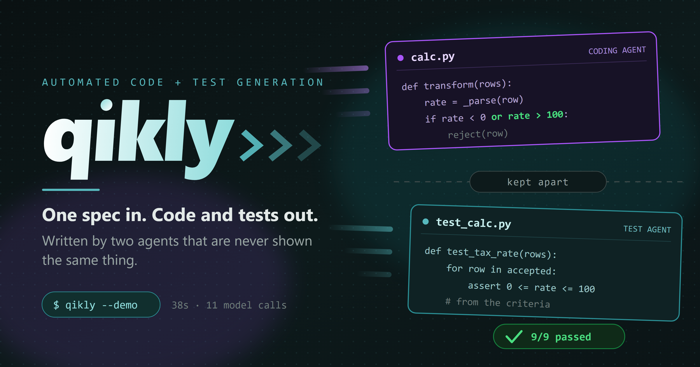
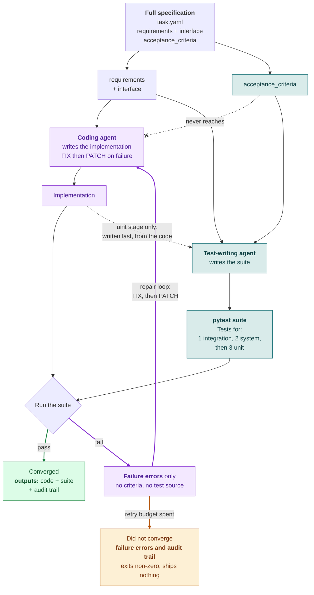

<!--
One of three. See MAINTAIN.md: these three files, README.md, docs/index.html
and the investor deck move together. A number changed here has to change in
all of them.
-->

# Engineering a Better System for Testing AI-Generated Code

**Your AI writes both the code and its tests. How do you know the tests are really valid?**

**The solution: two agents. One turns the acceptance criteria into tests. The other writes the code and never sees the acceptance criteria.**



Imagine a student who writes the exam paper, writes the answer key, and then sits the exam. They pass. Obviously they pass. Nobody would accept that as evidence the student knows the material, and nobody should.

That is what happens when one model is handed a specification containing the acceptance criteria and asked to produce both the implementation and the suite that checks it. It reads the spec, resolves every ambiguity in it, writes code according to those resolutions, and then writes tests according to *the same resolutions*. Where the spec said "reject malformed rows" and left "malformed" undefined, the agent picked a definition, implemented it, and then tested that definition. Everything goes green. It was always going to.

Run one model at temperature zero on both jobs and the two resolutions are almost identical *by construction*: the verification step burns compute and returns a tick that carries no information about whether the code is correct. That effect should get worse as models improve, since every gain in determinism tightens the agreement between the code and the tests that judge it. That last sentence is a working assumption rather than a measurement, and nothing here tests it.

The fix is to take the answer key away from the student. Test generation gets the acceptance criteria in full. The coding agent gets the same specification with that section cut out, and when a test fails it sees only the failure message, never the rule it broke. Now a green suite means something happened: code written by someone who could not read the standard nevertheless satisfies it.

This post is about a tool I built to do exactly that. Here in part 1: what it
is, and one real repair followed end to end so you can judge the idea on
something concrete rather than on a claim.

---

**This is part 1 of three.**

| | | |
|---|---|---|
| **1. The case** (you are here) | [2. How well it works](design_2_performance.md) | [3. How it is built](design_3_mechanism.md) |

## How it works, in one diagram



**Purple is what the coding agent can see. Teal is what the standard is
written from.** They never touch. The purple arrows are the repair loop, and
that is where almost all of a run happens. A run that never converges is still worth having: it exits
non-zero, names the blocking tests, and keeps the same complete record. A failing suite sends the coding agent the failure text and nothing
else, it produces a fix and a patch, and the suite runs again. That cycle
repeats until the stage passes or the retry budget runs out, and each stage
clears before the next is generated.

| | Receives |
|---|---|
| **The test generation agent** | The requirements, the interface contract, and every acceptance criterion in full. It writes integration, system and unit tests against the standard. |
| **The coding agent** | The same file with the criteria section removed, plus the text of whatever test just failed. The same vague brief a developer usually works from. |

Two dotted lines in the diagram, pointing opposite ways. The first is the whole
idea: the coding agent is never told the acceptance criteria it is judged
against, only the requirements and the interface, so when a test fails it has to
reason from behaviour rather than recall an answer it was given. The second is the one exception, and it runs the other way: unit tests
are written last, from the code, because they have to name real functions.

---

## One simple end to end repair loop, for a code implementation that did not originally enforce a maximum value for the tax rate (100%)

Everything below is lifted from a single real run of the bundled `CALC_TAX`
task, on `gemini-3.5-flash-lite`. It is abbreviated, not
invented: the prompt fragments, the failure text, the reasoning and the diff
are what actually passed through the loop.

### 1. What the coding agent is given

The task file has three parts. The coding agent receives two of them.

First the **requirements**, in the words a person would use:

```yaml
requirements:
  - "Read both CSV files listed in this task's inputs (input_01.csv and
     input_02.csv), and combine their rows into a single list before
     validation"
  - "Validate each row: order_id, item_price, quantity, tax_rate
     (a percentage, e.g. 8.25 means 8.25%)"
  - "Apply reasonable, strict real-world data-quality validation ...
     reject anything malformed, implausible, or out of range"
```

The task reads **two** CSV files rather than one because the orders arrive as
two separate batches, and combining them before validation is itself part of
what the tests check. Nothing about the tax rule depends on there being two;
it is there so the pipeline has a real extract step to get wrong.

Note what "reasonable" and "out of range" do not say. They do not say where the
range ends. A developer handed this would have to decide, and so does the
agent.

Then the **interface**, the contract as a description rather than as code:

```yaml
interface:
  module: "outputs.agent_src.code.CALC_TAX.calc"
  integration_functions:
    - "extract(input_path) -> list[dict]"
    - "transform(rows) -> dict   # {\"accepted\": [...], \"rejected\": [...]}"
    - "load(data, output_path) -> None"
```

### 2. What it is not given

The same file carries eleven acceptance criteria. This is one of them:

```yaml
  - "tax_rate is only valid if it is a non-negative number -- a negative
     tax_rate is invalid. A tax_rate representing more than 100% is also
     invalid"
```

That criterion goes to the test-writing agent in full. It is cut out of the
file before the coding agent is handed it, and `qikly --explain CALC_TAX`
prints both halves so you can see the cut.

### 3. The first code implementation, and the test it fails

The agent writes `calc.py` from the spec above. Its validation reads:

```python
tax_rate = _parse_decimal(rate_str)
if tax_rate is None or tax_rate < 0:
    # reject
```

The coding agent only wrote half the rule. It has the half that rejects a
negative rate, and it is missing the half that asserts the value does not
exceed 100%. Therefore the test fails. The suite, written from the full
criteria, contains a test the agent has never seen:

```
outputs/tests/CALC_TAX/integration/test_integration.py::test_tax_rate_validation_rules FAILED

    for row in result["accepted"]:
        rate = float(row["tax_rate"])
>       assert 0 <= rate <= 100
E       assert 150.0 <= 100
```

8 of 9 integration tests pass. This one does not.

**Why an integration test and not a unit test?** Because of when it was
written. At that point no implementation existed, so the only names the
test-writing agent could use were the ones the `interface` section promised:
`extract`, `transform`, `load`.

This test calls **`extract` then `transform`**, feeding the first one's output
into the second, and stops there: `load` only writes the result to disk, and the
tax rule is already visible in what `transform` returns.

Integration tests are not every pair of functions. They follow **the chain the
requirements describe**, `extract` to `transform` to `load`, and each test walks
as much of that chain as its property needs. There is one pipeline, and the
number of tests is set by how many properties the acceptance criteria assert
about it. Nine here, for eleven criteria. The single end-to-end entry point, `run_calc`, is tested separately at
the system stage.

That constraint shapes the assertion. It cannot feed the code a tax rate of 150
directly, because it does not choose the input; it reads whatever the fixture
files contain. So it asserts an **invariant over the output**: whatever ends up
accepted must have a rate between 0 and 100. The bad row was already sitting in
the fixture data, and the invariant caught it.

The unit stage, generated later from the finished code, writes the same rule the
other way round, because by then it can import internal helpers and construct
inputs:

```python
invalid_rates = ["-0.01", "-5", "100.01", "150", "abc", ""]
for tr in invalid_rates:
    res = transform([{"order_id": "F1", "item_price": "10.00",
                      "quantity": "1", "tax_rate": tr}])
    assert len(res["accepted"]) == 0
```

Same criterion, two stages, two styles: an invariant over real data first, then
the constructed edge cases once there is code to point at.

### 4. The FIX, what goes back to the coding agent

Exactly what is above: a test name and an assertion error. Not the criterion,
not the test source, not an explanation. From that alone it produces a **FIX**,
which is **reasoning rather than code**:

```
failure_summary: test_tax_rate_validation_rules failed because a tax rate
                 greater than 100 was incorrectly accepted.
root_cause:      The tax rate validation logic lacks an upper bound check,
                 allowing rates above 100% (e.g. 150).
plan:
  - Add a validation rule to ensure tax_rate is less than or equal to 100
    (and non-negative).
target_files:
  - outputs/agent_src/code/CALC_TAX/calc.py
```

It has reconstructed the withheld rule from one failing assertion.

### 5. The PATCH

The FIX names the files; a second call produces a unified diff of only those
files, applied all or nothing:

```diff
--- a/outputs/agent_src/code/CALC_TAX/calc.py
+++ b/outputs/agent_src/code/CALC_TAX/calc.py
@@ -52,3 +52,3 @@
         tax_rate = _parse_decimal(rate_str)
-        if tax_rate is None or tax_rate < 0:
+        if tax_rate is None or tax_rate < 0 or tax_rate > 100:
             rej = dict(row)
```

### 6. The stage clears, and the earlier ones are re-checked

A run works through three stages, and the console names each one by number.
**Stage 1 is the integration tests** and **stage 2 the system tests**, both
written from the specification before any code exists; stage 2 drives the
single end-to-end entry point, `run_calc`, rather than the individual
functions. **Stage 3 is the unit tests**, generated last, once there is code
whose internal helpers they can import and call. Every stage has to pass before
the next one is generated.

```
[stage 1/3] [iteration 3] 9/9 passed
[stage 2/3] [iteration 1] 5/5 passed
[stage 1/3] [iteration 1-regcheck] 9/9 passed
```

Then the unit stage is generated, from the code that now exists, and the same
loop runs again. That run converged in 38 seconds and 11 model calls, for about
\$0.006.

### What this example shows

The coding agent eventually wrote `tax_rate > 100`, and only because a test
told it 150 was wrong, not because a criterion told it 100 was the limit. Had
it been handed the criteria, it would have written that bound on the first
attempt, the test would have passed immediately, and the green would have meant
only that one model agreed with itself twice.

Note that in real scenarios it is often impractical to hand over all the
criteria in advance, for example when many edge cases exist.

The failure is the evidence. It is what a test is capable of producing, unlike
a shared context, which cannot do that.

---

## Where to go next

That is the whole idea, demonstrated once end to end. Two questions follow
naturally, and each has its own part.

**Does it actually work, and how often?** Three sweeps, 967 runs, what
reproduced and what did not, including the results this project measured and
then withdrew. [Part 2: How well it works](design_2_performance.md).

**How is it built, and how do I use it on my own specification?** The five
agents, the FIX and PATCH separation, the stage ordering, and the command to
run for whichever parts of a task file you already have.
[Part 3: How it is built](design_3_mechanism.md).
